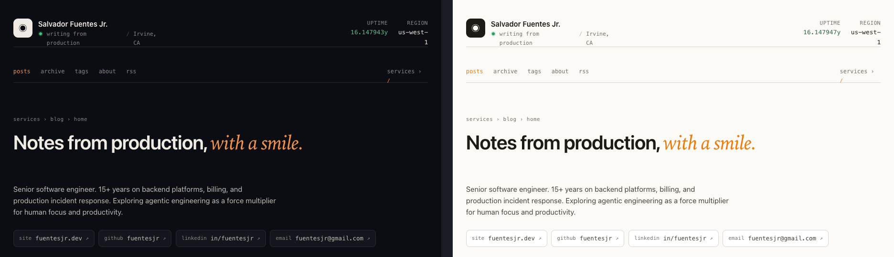

# jekyll-theme-uptime

A Jekyll theme adapted from Salvador Fuentes Jr.'s personal site. A "platform / SRE dashboard" aesthetic applied to blog writing — warm orange accent, Fraunces serif for prose, Geist & Geist Mono for UI, dark-first with a light mode, and a `⌘K` command palette for navigation.



---

## Installation (as a remote theme — recommended)

This is the simplest path for GitHub Pages. No RubyGem publishing, no version bumps — just push to a repo and reference it.

### 1. Put this theme in its own GitHub repo

Create a new public repo, e.g. `fuentesjr/jekyll-theme-uptime`, and push the contents of this folder to it.

### 2. In your blog repo (`fuentesjr/blog`), edit `_config.yml`

```yaml
# Remove or comment out minima:
# theme: minima

remote_theme: fuentesjr/jekyll-theme-uptime

plugins:
  - jekyll-remote-theme
  - jekyll-feed
  - jekyll-seo-tag
  - jekyll-sitemap

# Theme settings (all optional — defaults shown)
uptime:
  accent_hue: 55           # warm orange (oklch hue). Try 155 for moss, 260 for indigo.
  default_theme: dark      # dark | light — what visitors see on first load
  default_density: comfortable  # compact | comfortable | spacious
  show_command_palette: true
  footer_note: "Built with HTML, serifs, and restraint."

# Site identity
title: Salvador Fuentes Jr.
tagline: Senior software engineer. Backend platforms, financial systems, on-call with a smile.
description: >
  Notes on billing, distributed systems, incident response, and agentic engineering.
author:
  name: Salvador Fuentes Jr.
  email: fuentesjr@gmail.com
  location: Irvine, CA

# Contact links shown in the header and footer
social_links:
  - kind: site
    label: fuentesjr.dev
    href: https://fuentesjr.dev
  - kind: github
    label: fuentesjr
    href: https://github.com/fuentesjr
  - kind: linkedin
    label: in/fuentesjr
    href: https://linkedin.com/in/fuentesjr
  - kind: email
    label: fuentesjr@gmail.com
    href: mailto:fuentesjr@gmail.com
```

### 3. In your `Gemfile`

```ruby
source "https://rubygems.org"

gem "jekyll", "~> 4.3"

group :jekyll_plugins do
  gem "jekyll-remote-theme"
  gem "jekyll-feed"
  gem "jekyll-seo-tag"
  gem "jekyll-sitemap"
end
```

Run `bundle install`.

### 4. GitHub Pages note

GitHub Pages supports `jekyll-remote-theme` out of the box, so the default Pages build will just work. If you run into the plugin allow-list, see the GitHub Actions workflow at the bottom of this README.

---

## Installation (as a local Gem theme — optional)

If you prefer a proper gem:

```ruby
# Gemfile
gem "jekyll-theme-uptime", path: "../jekyll-theme-uptime"
```

```yaml
# _config.yml
theme: jekyll-theme-uptime
```

Publishing to RubyGems is documented on [jekyllrb.com](https://jekyllrb.com/docs/themes/#publishing-your-theme) — but honestly, remote-theme is easier for a one-person blog.

---

## Structure

```
_layouts/
  default.html   — masthead + corner buttons + footer + palette shell
  home.html      — post list, rendered as the "services table" from the dashboard variant
  post.html      — single post, Fraunces body, §-labelled section headers
  page.html      — about / standalone pages
  tag.html       — one page per tag, filtered post list

_includes/
  head.html
  header.html    — dash-top style top bar with name, status dot, uptime, links
  footer.html
  corner-controls.html  — fixed ?, ⌘K, theme-toggle buttons
  command-palette.html
  post-card.html        — shared row component used in home & tag lists
  social-links.html

_sass/uptime/
  _tokens.scss   — CSS custom properties (light + dark + density)
  _base.scss
  _header.scss
  _dashboard.scss   — top bar, SLI tiles, services table, manifest block
  _posts.scss       — prose styles for single-post layout
  _palette.scss     — cmdk
  _corner.scss
  _footer.scss
  _print.scss

assets/
  css/main.scss
  js/site.js        — vanilla-JS command palette + theme toggle + keyboard nav

_config.yml
jekyll-theme-uptime.gemspec
```

---

## Features

- **Dashboard top bar** with status dot, "uptime" counter (counts years since `site.uptime.career_start`), region, and quick links.
- **Home page** renders your posts as rows in the "services" table — each post expands to reveal its excerpt. A "now" status banner sits above the fold to surface `site.uptime.now.body`.
- **Featured tiles** with a serif headline, age badge (`new` / `17d` / `3mo` / `1y`), and a stable per-post sparkline — distinct from the row list.
- **Link posts** — add `kind: link` + `external_url:` front matter for a compact row with an external-arrow affordance and host badge.
- **Single-post layout** uses Fraunces for body prose with Geist Mono for headings, meta, and code. Drop-capped first paragraph (opt out with `dropcap: false`, auto-skipped under 300 words), §-labelled section headers, read-time + word-count in the byline.
- **Rouge syntax highlighting** theme tuned to the palette — re-tints when you change `accent_hue`.
- **Copy-code** button revealed on hover of every `<pre>` in post bodies.
- **Full-bleed figures** — wrap `<figure class="fullbleed">` to break out of the reading measure up to the app width.
- **Edge-glow reading progress** on the left side of the viewport during single-post reading.
- **Command palette** (`⌘K`) with fuzzy matching, recent-action weighting, post titles (up to 60), and "Jump to #tag" entries.
- **Dark / light / density** preferences persist to `localStorage`. Press `D` to cycle density.
- **Accent preview via URL** — append `?accent=260` (or any OKLCH hue) to any URL to try an accent color live; persists to localStorage. Command palette has a "reset" action.
- **404 page** in the same visual vocabulary (HTTP trace card + quick actions).
- **Sitemap** via `jekyll-sitemap` (plugin added by default). `robots.txt` auto-generated.
- **Print-friendly** single-post CSS.
- **No React.** Vanilla JS.

---

## Post front matter

```yaml
---
layout: post
title:  "On watching the billing graph during a launch"
date:   2026-04-20 10:00:00 -0700
tags:   [billing, copilot, sre]
excerpt: "The first $10M of ARR moves differently than the second."
reading_time: 6   # optional, auto-calculated if omitted
dropcap: false    # optional, disables the drop cap on this post
---
```

### Link posts

```yaml
---
title: "Teach by doing, not by shipping"
date:  2026-04-10
kind:  link
external_url: https://example.com/teach-by-doing
tags:  [learning]
---
```

The post-card include renders link posts as a compact row with a `→` prefix, the host name, and an external-arrow cue — no separate page.

### Featuring posts

```yaml
# _config.yml
featured_posts:
  - billing-graph
  - outrunning-mysql
```

The home page pins these as featured tiles above the services table. The slug is the value of `post.slug` (by default the filename minus date and extension).

---

## Permalinks

Default is `/:year/:month/:day/:title/` (dated, blog-ish). Override in your site's `_config.yml`:

```yaml
# Minimalist (one-segment URLs):
permalink: /:title/

# Namespaced under /notes:
permalink: /notes/:title/
```

---

## Tag pages

Tag pages work via the `tag` layout, which expects each tag to have its own stub file (Jekyll doesn't auto-generate pages from `tags:` front matter on its own).

The theme ships a small generator script:

```sh
ruby bin/generate-tag-pages
```

Walks `_posts/`, collects unique tags, and writes `_tags/<slug>.md` stubs. Existing stubs are left alone so you can customize them. You can wire this into your CI or pre-commit hook, or just run it whenever you add a new tag. If you'd rather use a plugin, [jekyll-archives](https://github.com/jekyll/jekyll-archives) is the canonical option.

---

## Accent color

Set a default in `_config.yml`:

```yaml
uptime:
  accent_hue: 155   # moss; try 260 for indigo, 340 for rose, 55 for warm orange
```

Preview any hue live by appending `?accent=<hue>` to any URL — e.g. `/2026/04/20/billing-graph/?accent=260`. The value persists to `localStorage`, so share links like this with yourself to A/B test. The command palette has a **"Accent: reset to theme default"** action to wipe the override.

---

## GitHub Actions build (if you hit plugin issues)

Create `.github/workflows/pages.yml` in your **blog** repo:

```yaml
name: Build & deploy
on:
  push:
    branches: [main]
  workflow_dispatch:

permissions:
  contents: read
  pages: write
  id-token: write

jobs:
  build:
    runs-on: ubuntu-latest
    steps:
      - uses: actions/checkout@v4
      - uses: ruby/setup-ruby@v1
        with:
          ruby-version: "3.2"
          bundler-cache: true
      - run: bundle exec jekyll build
        env:
          JEKYLL_ENV: production
      - uses: actions/upload-pages-artifact@v3
        with:
          path: _site
  deploy:
    needs: build
    runs-on: ubuntu-latest
    environment:
      name: github-pages
      url: ${{ steps.deployment.outputs.page_url }}
    steps:
      - id: deployment
        uses: actions/deploy-pages@v4
```

Then in your repo's **Settings → Pages**, set source to "GitHub Actions".

---

## License

MIT.
